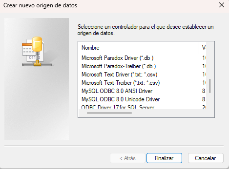

# Haz esto
```bash
cd C:\
```
```bash
git clone https://github.com/AlexGarciniGT/Proyecto-IN.git

cd "Proyecto-IN"

git remote add origin https://github.com/AlexGarciniGT/Proyecto-IN.git

git branch -M main

```
```

```

---

## Base de datos OLTP Mysql
---

servidor, host : localhost
puerto: 3307

`contraseña`
    
    root





## Base de datos OLTP Sql Server
---

localhost,1433

`contraseña`
    
    Oltp2019.


## Base de datos stage
---

localhost,1432

`contraseña`
    
    Oltp2019.
a

## Base de datos Data Ware House
---

localhost,1431

`contraseña`
    
    Datawh2019.

## visual studio
---


# para enviar tu parte:

git commit -am `"entre comillas dobles escribe una descripción de lo que hiciste borra esto"`

git push -u origin main